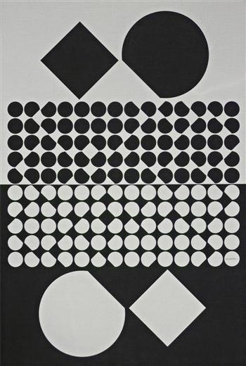
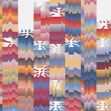
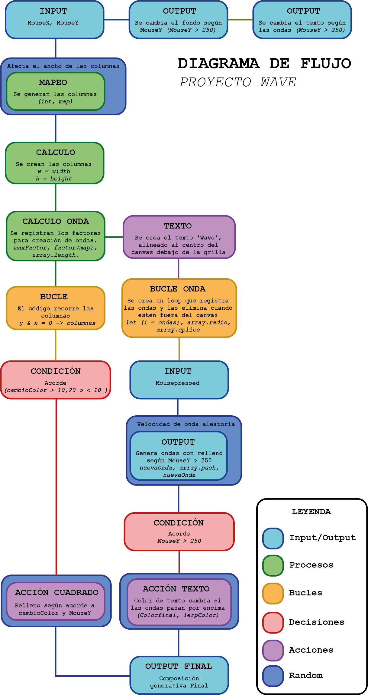

## Proyecto Wave

Hecho por Nicole Forné

### Solemne II | Pensamiento Computacional

Repositorio de encargo solemne 2 Pensamiento Computacional 22/05/2026

# DESCRIPCIÓN OBJETIVA

Wave es una grilla de rectángulos interactiva a través de un mouse.

Al correr el código, se puede observar una grilla de tonos azules que cambia constantemente cada ciertos frames; su cantidad varía según la posición del mouse, pero está limitada para evitar una cantidad visualmente molesta de columnas creadas. La posición Y del mouse especifica que la tonalidad de la grilla transicione a un tono caliente naranjo con partículas amarillas.

Wave presenta un input y es hacer clic izquierdo con el mouse, lo que genera como output una onda de tonalidad blanca que se expande por la grilla. La onda se encarga de revelar el nombre del proyecto que se esconde detrás de la grilla mientras la onda pasa por encima de la palabra.

# DESCRIPCIÓN CONCEPTUAL

La idea de Wave es crear una interacción breve pero continua, permitiendo al usuario crear múltiples ondas para su entretenimiento. Se dialoga con el arte generativo, ya que Wave diseña su propio diseño continuamente de manera impredecible junto al Op Art gracias a esta misma recreación constante, la cual se distorsiona.

Para este proyecto se utilizaron repeticiones de patrones y proporciones, considerando que el nombre del proyecto se mantiene presente dentro de la grilla de rectángulos constante, la cual nunca supera en tamaño el título del proyecto, y crea una unión entre ambas partes en cuanto se genera una onda.

# REFERENTES

### Cassiopée II NB

Hecha en 1958 por Victor Vasarely, sirvió para dar paso a la idea de crear una división entre la paleta cromática.

[Link a obra; no pude descargar la imagen.](https://www.wikiart.org/en/victor-vasarely/quasar-1966)

### Quasar

Hecha en 1966 también por Victor Vasarely, su composición, aunque no buscaba ser igual, permitió jugar con diferentes tonalidades y generar una transición entre las tonalidades frías y calientes.

### El rapto

Hecha en 2024 por Dmitri Cherniak, composición que dio paso a la selección de la paleta cromática que se utilizó y la jerarquía visual.

# INPUTS, OUTPUTS, SISTEMA

[Link a p5.js editable de Wave](https://editor.p5js.org/NicoIe/sketches/rlvtOq8XY)

### Reglas del sistema

El lienzo funciona como una grilla geométrica interactiva que se divide en columnas dinámicas, si el usuario mueve el cursor por debajo de la mitad de la pantalla, la grilla es alterada de un estado azulado a uno anaranjado. Además, cada clic genera una onda expansiva autónoma con velocidad propia que viaja por el espacio, autodestruyéndose al salir de los límites para proteger el rendimiento del programa.

> Me gustaria comentar que pude experimentar con algunos comandos que no habian sido presentados en clases previo a la solemne II gracias a que e tenido contacto con programas de codigo previos como Lua, lo que me permitio crear las ondas gracias a la similitud de Array con ciertos aspectos como FindFirstChild() y tablas.

### Modelo de interactividad

Wave combina dos capas de relación con el usuario. Por un lado, la interactividad continua ocurre al desplazar el mouse, permitiendo ;deformar en tiempo real la densidad de la grilla y alterando la paleta cromática. Junto a esto, se tiene una interactividad discreta que se activa mediante clics, permitiendo al usuario inyectar perturbaciones individuales que alteran el sistema con ondas expansivas.

### Flujo de datos

| Datos de Entrada (Inputs) | Procesamiento y Transformación | Respuesta Visual (Outputs) |
| ------------- |:-------------:| -----:|
| MouseX, MouseY | La función map() transforma las coordenadas de píxeles en cantidad de celdas y en factores de color. | La grilla se vuelve más densa o dispersa y el fondo cambia entre tonos fríos y tonos calientes. |
| Clic del Usuario | El evento mousePressed() causa que se genere una onda con posición fija y velocidad aleatoria. | Nace una onda expansiva desde el punto exacto donde se presionó con el mouse. |
| Cálculo interno (dist y abs) | El algoritmo mide la distancia entre las celdas o el texto y el borde de las ondas activas. | Las celdas y el texto central se iluminan al ser tocados por la onda. |
| Variables Aleatorias | Funciones random() alteran constantemente el tamaño individual y la tonalidad de cada celda por frame. | La grilla adquiere una textura cambiante y orgánica |

